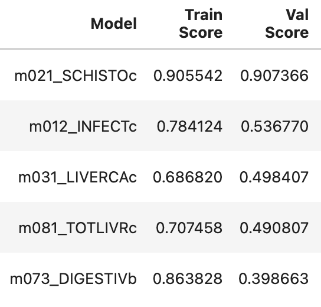
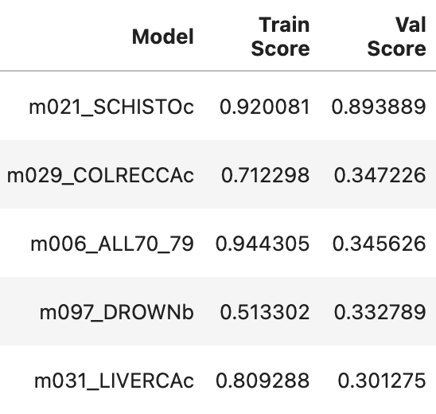
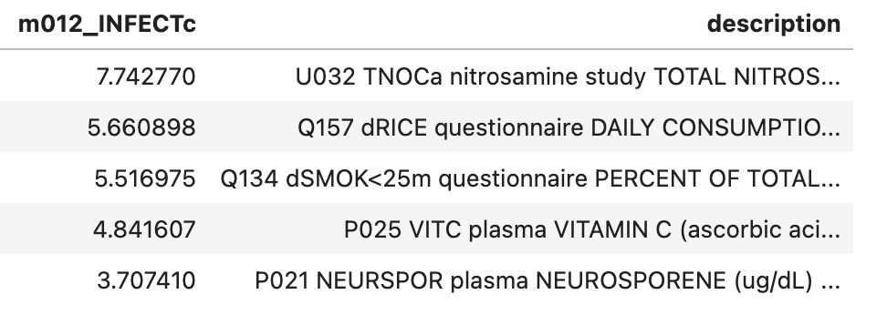
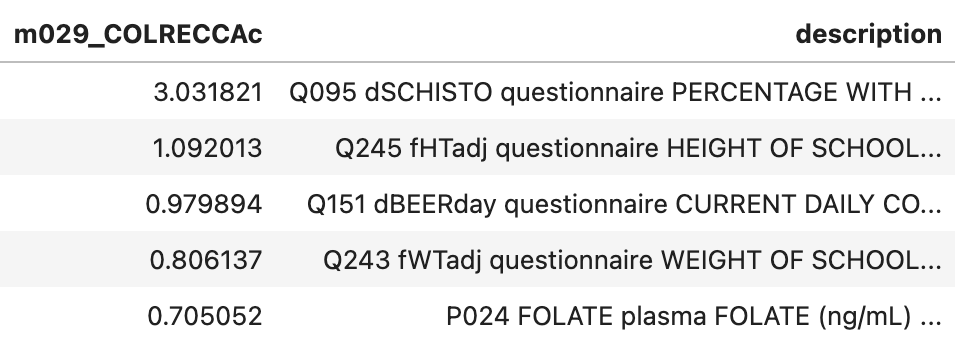

# Project 4: Lifestyle and Mortality from The China Study

## Executive Summary
As data scientists, we are constantly looking for ways to better understand the world around us through the lens of data.  How can we make an impact, how can we improve our lives, how can we explain tragedies?  One topic that our group is particularly interested in is health and mortality.  We want to better understand mortality rates and what lifestyle choices impact different causes of death.  There are so many environmental factors that might be bigger indicators, but individual lifestyle decisions regarding diet, habits, location, etc can also be factors.  To look into this question, we turned to The China Study.

The China Study is a book written by TC Campbell, a nutrional biochemist.  Over the course of 20 years, a team of researchers from Cornell, Oxford, and the Chinese Academy of Preventative Medicine performed a study of random population samples from the 69 rural counties of China.  The study covered an extensive list of lifestyle questions, diet intake records, and even measurements of blood and urine samples.  Each county also provided detailed records on mortality and the different causes of death to correlate the data by county.  From TC Campbell's [Center for Nutrition Studies](https://nutritionstudies.org/the-china-study/), here is a summary of the survey methodology:

>"Sixty five counties in rural China were selected for the study and dietary, lifestyle and disease characteristics were studied. Within each of the 65 counties, 2 villages were selected and 50 families in each were randomly chosen. One adult from each household (half men and half women), 6,500 for the entire survey, participated. Blood, urine and food samples were obtained for later analysis, while questionnaire and 3-day diet information was recorded."

The goal of this study was to investigate links between nutrition and the development of chronic diseases like cancer, heart disease, and diabetes.  The results of the study led TC Campbell and his son to write *The China Study*, with the primary conclusion that a diet high in animal-based foods, particularly meat and dairy, is associated with a higher risk of chronic diseases, while a diet based on whole, plant-based foods is associated with a lower risk.  He argues that the nutrients in plant-based foods are more beneficial than getting them from supplements.  This book became very popular and increased participation in diets like plant-based, Whole30, raw-foods, and more.

Over the years, the book has received both praise (from [The New York Times](https://archive.nytimes.com/well.blogs.nytimes.com/2011/01/07/nutrition-advice-from-the-china-study/)) and critique (from [Science-Based Medicine](https://sciencebasedmedicine.org/the-china-study-revisited/), the [American Journal of Clinical Nutrition](https://academic.oup.com/ajcn/article/71/3/850/4729291?login=false), and [other data-drive nutritionists](https://deniseminger.com/the-china-study/)).  However, there has consistently been praise for the data itself and the effort taken to ensure a thorough, diverse, and repetitive dataset.  As data scientists, we wanted to see what knowledge we could glean from this treasure trove of data itself, instead of relying on the analysis of the researchers.  Of course, they have clearly spent much more time on their analysis and with the data overall than we had, but the exercise is useful.  And there have been many papers over the years that use the China study data to form their own conclusions.

All the original data files were available on the website for the [Center for Nutrition Studies](https://nutritionstudies.org/the-china-study/).  It is split into the results from three survey periods: 1973-1983, 1986-1989, and 1993.  The data is also broken down into the following categories:
* Mortality variables
* Plasma, red blood cell, and urine variables
* Diet and geography variables
* Lifestyle questionnaire variables

We decided to take all these variables and create a model pipeline that would allow us to define a relationship between the various variables and the mortality rates.  Essentially, we want to answer the question "Can we predict mortality rates based on lifestyle and diet variables?"

The results of our modeling are not intended to be prescriptive - we are not trying to define the healthiest possible diet or lifestyle.  After all, so many of these variables are not within our control.  However, we believe there is value in trying to understand correlations between diet/lifestyle, and chronic disease/mortality.  The goal of this project would be to create a resource that everybody can use to evaluate their own lifestyle and see where feasible adjustments can be made.  

## Data Information
We collected all the data and methodology research available from the [Center for Nutrition Studies](https://nutritionstudies.org/the-china-study/).  It contains the following items:

|File Name|Years|Description|
|---|---|---|
|[CH83M.csv](./data/original_data/CH83M.csv)|1973-1983|mainland mortality variables|
|[CH83DG.csv](./data/original_data/CH83DG.csv)|1973-1983|mainland diet and geographic variables|
|[CH83PRU.csv](./data/original_data/CH83PRU.csv)|1973-1983|mainland plasma, red blood cell and urine variables|
|[CH83Q.csv](./data/original_data/CH83Q.csv)|1973-1983|mainland questionnaire variables|
|[CH89M.csv](./data/original_data/CH89M.csv)|1986-1989|mainland mortality variables|
|[CH89DG.csv](./data/original_data/CH89DG.csv)|1986-1989|mainland diet and geographic variables|
|[CH89PRU.csv](./data/original_data/CH89PRU.csv)|1986-1989|mainland plasma, red blood cell and urine variables|
|[CH89Q.csv](./data/original_data/CH89Q.csv)|1986-1989|mainland questionnaire variables|
|[CH93PRU.csv](./data/original_data/CH93PRU.csv)|1993|mainland plasma, red blood cell and urine variables|
|[CH93Q.csv](./data/original_data/CH93Q.csv)|1993|mainland questionnaire variables|
|[CHTAIM.csv](./data/original_data/CHTAIM.csv)|1986-1989|Taiwan mortality variables|
|[CHTAIPRU.csv](./data/original_data/CHTAIPRU.csv)|1986-1989|Taiwan plasma, red blood cell and urine variables|
|[CHTAIQ.csv](./data/original_data/CHTAIQ.csv)|1986-1989|Taiwan questionnaire variables|
|[CHNAME.txt](./data/original_data/CHNAME.txt)|-|all the variable codes and their descriptions|

We decided to focus on the group of datasets from 1986-1989 mainland China for a few reasons.  This iteration included a full set of all four surveys - mortality, diet, blood/urine, and questionnaires.  It also covered additional counties and more individual respondents per county, so the datasets cover a larger sample size.  And finally there were more questions covered in this iteration than in the other ones.

The downloaded data files came with a readme that contained the below information.  We used this explanation to make decisions about filtering by gender and xiang when appropriate:
> The first record in each file lists the keywords for variables included in that file.
>  In each file, for each county there are 9 records in total:
> * Male xiang 1
> * Male xiang 2
> * Male xiang code 3 (=mean of xiang 1 and xiang 2 or county value)
> * Female xiang 1
> * Female xiang 2
> * Female xiang code 3
> * Total xiang 1, where Total (sex code T) =mean of male and female
> * Total xiang 2
> * Total xiang code 3
>  For consistency of format all 9 records are included even where a record consists of all missing values (e.g. mortality values are available only at the county level, so xiang-specific values are all missing)

The CHNAME.txt file was a valuable reference because it contained the description for each question.  Additional details about each survey and the wording of each question can be found in the resource papers in the [research](./research) folder.

An example of the code explanations is below.
|Code|Keywords|Description|
|---|---|---|
|M039| BRAINCAc|   mortality BRAIN TUMOUR (MALIGNANT OR NOT) AGE 35-69 (stand. rate/100,000) (ICD9 191, 225.0, 237.5, 239.6)|
|M040| LYMPHOMAc|  mortality LYMPHOMA AND MYELOMA AGE 35-69 (stand. rate/100,000) (ICD9 200-3)|
|M041| LEUKEMIAb|  mortality LEUKAEMIA AGE 0-34 (stand. rate/100,000) (ICD9 204-8)|                                                      
|...|
|D007| %ANPRKCAL|  diet survey PERCENTAGE OF CALORIC INTAKE FROM ANIMAL PROTEIN (for reference man)|                            
|D008| %PLPRKCAL|  diet survey PERCENTAGE OF CALORIC INTAKE FROM PLANT PROTEIN (for reference man)|
|D009| %CARBKCAL|  diet survey PERCENTAGE OF CALORIC INTAKE FROM CARBOHYDRATE (for reference man)|
|...|
|Q065| dWOODNOW|   questionnaire PERCENTAGE USE MAINLY WOOD/STALKS FOR COOKING NOW|
|Q066| dOTHFNOW|   questionnaire PERCENTAGE USE MAINLY OTHER FUEL FOR COOKING NOW|
|...|
|Q176| dEGGS|      questionnaire DAYS PER YEAR EAT EGGS|                          
|Q177| dMILK|      questionnaire DAYS PER YEAR CONSUME MILK OR DAIRY PRODUCTS|
|Q178| dJASMIN-T|  questionnaire PERCENT DRINK JASMINE TEA DAILY|         
                                                                                                                                             
## Data Cleaning
The raw data was downloaded as csv's, but we had to go through and clean and process each file so it would be usable in our model.  All the entries were strings with whitespaces, and empty cells were denoted with a `'.'` so we replaced the periods with empty strings, stripped whitespaces, and converted values to floats where possible.  

Additionally, each survey was performed slightly differently.  For example, the mortality surveys have data for `sex==M/F/T` across all counties, but only for `Xiang==3`, the diet surveys have data for `Xiang==1/2/3` but only for `sex==T`, and the questionnaire surveys have different response groups depending on the question (some questions were gender/xiang specific, and some questions may have been asked at different times by different researchers, hence the variance).  Because of this, we dropped rows that were fully null and questions that exceeded our null threshold.

We also renamed the columns in the mortality file with short descriptors so it was easier to know which mortality target we were using without going back and forth to our data dictionary constantly.

Finally we noticed that the counties were all coded alphabetically (`"AA"` through `"YA"`) and the `"NA"` county was read as NaN, so that had to be manually filled back in as a string.

## Exploratory Data Analysis
We performed initial EDA per each survey.  We created multiple useful bar charts that described interesting details like populations, community distributions of smoking habits, and protein intakes.  We also looked at mortality rates and compared mortality rates between men and women. This work helped us frame the context of the data and gave us the opportunity to explore each of the survey variables and understand them better. 

We also tried here to 'melt' the mortality dataframe which has breakdowns by county and age bracket.  'Melt' allows you to flatten a set of columns into row observations.  We hoped we could use age as it's own feature variable and increase our observation dimensions.  But we realized quickly that since we only had age breakdowns in the mortality dataset, we wouldn't be able to make our targets compatible with the other features from diet/geo, lifestyle questionnaire, and plasma/urine.

## Modeling
We proceeded to develop a model that would predict a given mortality rate based on the other features in a combined dataframe.

### Metrics for Evaluation
We are dealing with all continuous and numerical data for each of the variables.  We decided that a linear regression model would be the best option for modeling and interpreting our health variables.  To evaluate our models, we used $R^2$ to evaluate how much of the target variance is explained by our predictors and we used $RMSE$ to evaluate the error between $y_{true}$ and $y_{pred}$.  

We calculated a baseline score for the mortality_all_causes target as the mean of those values: $baseline = 14.05 deaths per 1000$.  However, we recognized that this wasn't a very useful metric going forward because we wanted to create a pipeline for each possible feature, so it wouldn't be very helpful to evaluate them against the score for $baseline_{all-causes}$.

### Pipeline for Target Selection
For the initial round of modeling, we defined $y$ as one of the mortality columns and $X$ as the rest of the columns.  This scored really high but we realized that this was because our other mortality columns were leaking data into the model.  And we are not looking for comorbidities - we specifically wanted to see how the diet and lifestyle decisions affected different mortality targets.

The next step was to fix the data leakage by selecting one mortality column as $y$ and only columns from CH89DG, CH89PRU, and CH89Q for $X$.  This yielded really poor results, with $R^2$ scores below 0.1 and even negative in some cases.

From here, we went back to the original paper and read through the methodology a bit more.  We realized we needed to separate our data by gender, the way the researchers had done.  This is because there are very different answers for the lifestyle questions for different genders.  We applied a Lasso regularization to the Linear Regression as well and found much better scores.  Not all the targets could be explained well, but the scores improved to where they were mostly all positive (for $R^2$) and scores were closer to 0.5.

We took this final version of our model and created a pipeline so that, for each mortality target in CH89M, we could generate a lasso linear regression, produce the train/test scores, and save them to a results dataframe.

Of note, we tried a few other modeling techniques as well to see if they could yield beneficial results.  We tried both K-Means and DBSCAN as clustering methods to see if we could group the results and use that in our regression, but the result was not helpful.  We also tried PCA to reduce dimensionality since a significant problem was the fact that we had 69 observations and close to 300 features.  While it was a valuable exercise, it did not improve our scores by any measure.  So we went back to our original feature list.

## Results
We collected the scores from each target in a dataframe, and also collected the features and their coefficients in another.  Using Lasso worked well to reduce the feature space for each target.  Furthermore, because we used a standard linear regression, our coefficients are interpretable - the magnitude of each coefficient tells us how much of an impact that feature has on the prediction.

The feature importance coefficients for both the male and female pipelines were saved to csv's.  We created a `feature_lookup` function that allowed us to input a mortality target and gender and return the top five most important features and their descriptions from CHNAME.txt.

If we look at the two tables below, we see the best performing models in both the male and female pipelines.  After we'd finished most of our work, we realized that the first model in each still contained data leakage because the more important features were values from the questionnaire asking about Schistosomiasis. 

Male Pipeline Scores          | Female Pipeline Scores
:-------------------------:|:-------------------------:
 |  

But if we perform a feature lookup on the second best model in each case, we can see an example of how this tool would work for someone who wants to analyze the factors the contribute to certain mortality causes.  

`feature_lookup('m012_INFECTc', 'm')`          | `feature_lookup('m029_COLRECCAc', 'f')`  
:-------------------------:|:-------------------------:
  |   

## Conclusions & Recommendations
* We realized that our original goal of a mortality rate predictor was not feasible, for a few reasons.  The data from The China Study is great for analysis and understanding county-level trends, but is not best for a model because of the small observation size.  We also weren't able to find strong enough evidence (in terms of our scores) that would allow us to predict mortality from diet and lifestyle specifications.

* The social value of this project is instead in the analysis and the tool that allows us to look up important features based on a specific target.  Our pipeline makes it easy to use and quickly get information about the most correlated features.  We specifically disagree with the prescriptive method of The China Study which claims that the data fully supports a whole food, plant based diet.  

* Our best evaluation of this dataset is that a provides a great basis for individuals to see a list of possible health factors and make personalized changes as they see fit, according to their lifestyle.

## Next Steps
* To improve on this project and make it easier to use, we would like to make our `feature_lookup` tool more robust and design a better interface for it, such as in Streamlit.  However, to do so, we have to create a way to interpret a user's search input, such as 'Lung Cancer for adults' instead of limiting it to 'M035 LUNGCAmc'. 

* Similarly, it would be useful to add a reverse method to the lookup tool as well - users could input a feature such as 'using smoky coal for cooking' which would then look for feature coefficients for the 'Q063' variable and determine which mortalities (if any) it could affect.

* We found that there was still high collinearity and data leakage since we weren't filtering the feature lists.  This would require more work because we'd have to fine tune the feature list for each target, but we would like to develop a way to improve the feature elimination to further reduce dimensionality and overfitting.

* It would help to add data from other survey years to the training model, but it would require either more imputation or completely eliminating more columns that don't have enough values.